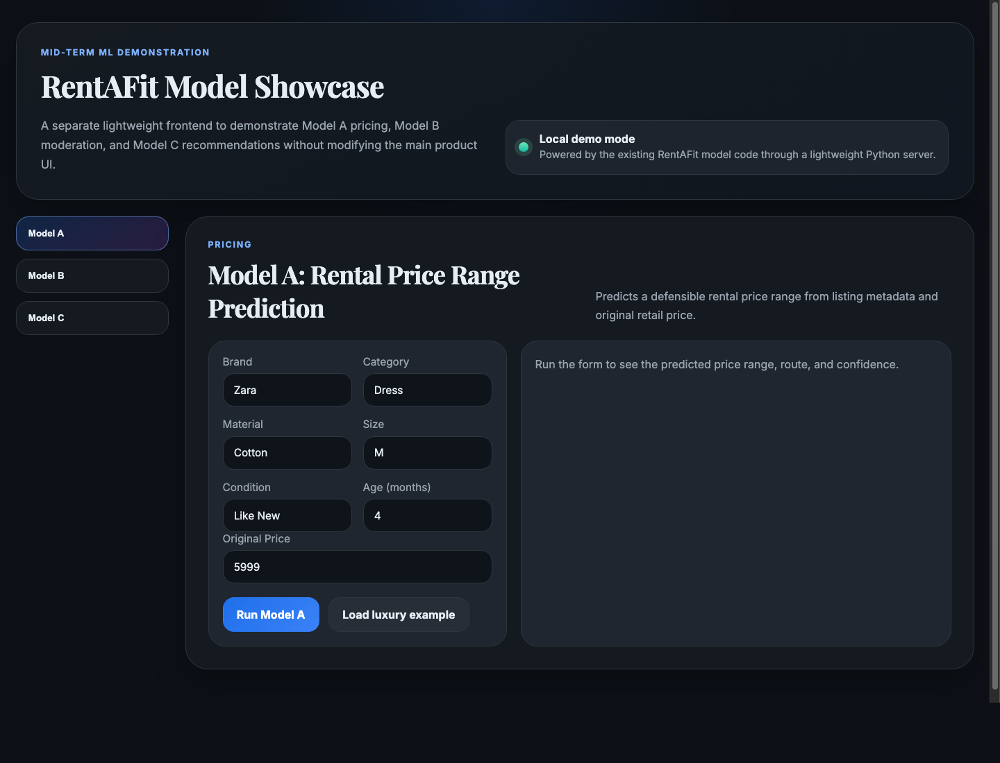
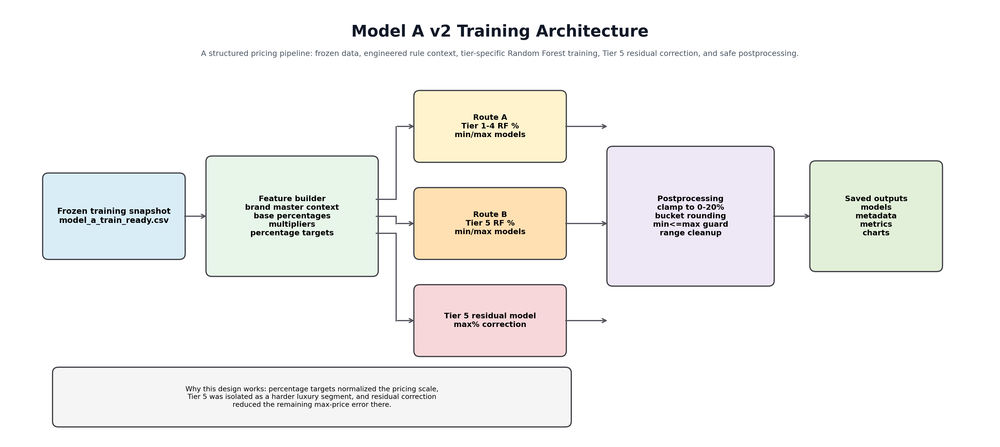
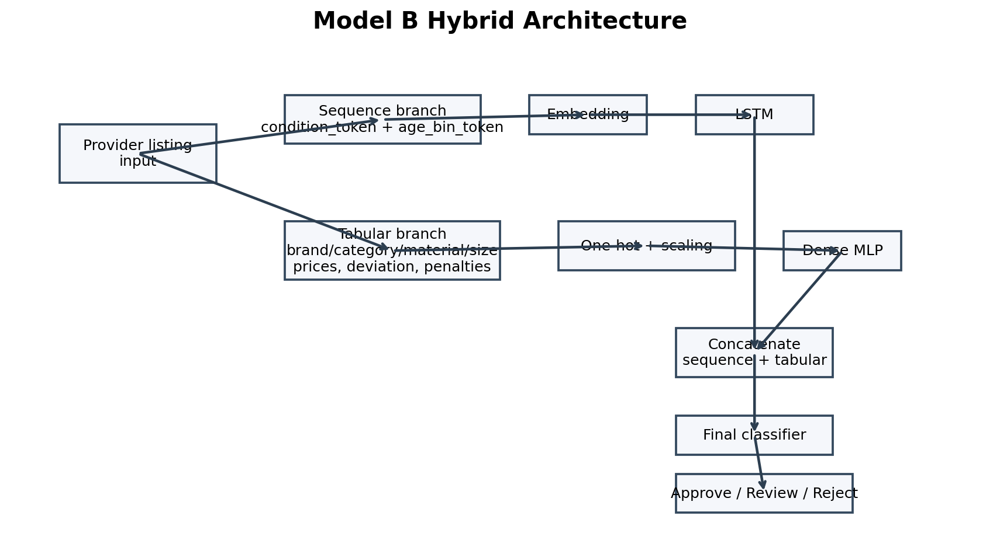
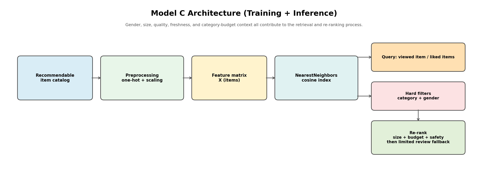

# RentAFit-ML


Machine learning workspace for the **RentAFit** platform.

This repository contains the complete ML layer for RentAFit: pricing, moderation, and recommendation systems, along with the datasets, trained artifacts, validation reports, and detailed technical documentation used to support the platform.

## Quick Start

```bash
python3 -m venv .venv
source .venv/bin/activate
pip install -r requirements.txt
```

Run the most useful smoke-test entry points from the repository root:

```bash
python3 code/model_a/inference/predict_price_range_simple_input.py --brand Prada --category Dress --material Silk --age_months 6 --size M --condition "Like New" --original_price 95000 --json
python3 code/model_c/inference/recommend_model_c_items.py --seed_item_id L0015 --top_k 5 --json
```

PyTorch is required for Model B runtime and the combined validation script. The repository now uses repo-relative paths throughout the runnable code, so the commands above work from this clone instead of depending on a separate local folder.

## ML Showcase Demo

This repository also includes a lightweight browser showcase for Models A, B, and C in [`showcase/ml_showcase/`](showcase/ml_showcase/README.md).

Run it from the repository root:

```bash
python3 showcase/ml_showcase/server.py --port 8090
```

Preview:



## Overview

### Model suite
- **Model A**: price range prediction for clothing rental listings
- **Model B**: listing moderation and lifecycle decision model
- **Model C**: content-based recommendation system for renter-side suggestions

### Included assets
- training and inference code
- frozen and generated datasets
- trained model artifacts
- validation reports and charts
- full model handbooks in Markdown and Word format

## Repository structure

```text
showcase/
  assets/
  ml_showcase/

code/
  api/
  model_a/
  model_b/
  model_c/
  shared/
  validation/

data/
  frozen/
  generated/

docs/
  model_a/
  model_b/
  model_c/

models/
  model_a/
  model_b/
  model_c/

reports/
  model_a/
  model_b/
  model_c/
  validation/
```

## Highlights

### Model A
- tier-aware Random Forest pricing pipeline
- range prediction with fallback safeguards
- documented training path from baseline to final model

### Model B
- hybrid LSTM + tabular moderation model
- lifecycle-aware status logic for stale listings
- gender-aware moderation policy and validation

### Model C
- policy-aware content recommender
- category, gender, size, budget, and quality constraints
- ranked top-k output with explanation tags

## Visual previews

### Model A pricing flow


### Model B hybrid moderation architecture


### Model C recommendation architecture


## Key results

| Model | Focus | Current headline result |
| --- | --- | --- |
| Model A | Price range prediction | Test MAE max `13.82` with `0` post-processed range violations |
| Model B | Moderation | Test macro F1 `0.9765` and test accuracy `0.9772` |
| Model C | Recommendation | Avg final score `0.7331` vs `0.7023` for the policy-aware random baseline |

## Verified sample outputs

### Model A pricing example

Sample command:

```bash
python3 code/model_a/inference/predict_price_range_simple_input.py --brand Prada --category Dress --material Silk --age_months 6 --size M --condition "Like New" --original_price 95000 --json
```

Observed headline output from this repo clone:

```json
{
  "final_price_range": {
    "min_price": 9300,
    "max_price": 11900,
    "source": "model_output"
  },
  "confidence": {
    "score": 0.9,
    "fallback_to_rule_range": false
  },
  "model_route": "tier_split_tier5"
}
```

### Model C recommendation example

Sample command:

```bash
python3 code/model_c/inference/recommend_model_c_items.py --seed_item_id L0015 --top_k 5 --json
```

Observed headline output from this repo clone:

```json
{
  "query_mode": "item_to_item",
  "seed_item": {
    "listing_id": "L0015",
    "brand": "Prada",
    "category": "Dress",
    "gender": "Women",
    "size": "S"
  },
  "policy_summary": {
    "same_category_only": true,
    "query_gender": "Women",
    "query_size": "S",
    "review_items_used": 0
  }
}
```

## Documentation

### Core handbooks
- `docs/model_a/Model_A_Holy_Book.docx`
- `docs/model_b/Model_B_Master_Document.docx`
- `docs/model_c/Model_C_Master_Document.docx`

### Validation
- `reports/validation/model_crosscheck_report.md`
- `docs/model_c/MODEL_C_VALIDATION_REPORT.docx`

### API layer
- `code/api/app.py`
- `code/api/README.md`

### Module-level guides
- `code/model_a/README.md`
- `code/model_b/README.md`
- `code/model_c/README.md`

## Reproducibility notes

This repository includes:
- frozen datasets used to build and validate the models
- generated intermediate datasets required by the current training flows
- trained model files used by the present inference pipelines

These assets were intentionally kept in the repository because they remain within manageable GitHub limits and make the ML work easier to review and reproduce.

The runnable code is now configured to resolve paths from the repository itself, which makes the clone portable and removes the dependency on a machine-specific `/Users/.../RentAFit` folder layout.

## Relationship to the main platform repository

This repository contains the ML layer only.

The separate main platform repository is intended to hold:
- frontend
- backend
- platform integration
- product flow implementation

## Current status

At the current snapshot:
- Model A is implemented, validated, and documented
- Model B is implemented, validated, and documented
- Model C is implemented, validated, and documented
- combined cross-check validation across all three models has been completed
